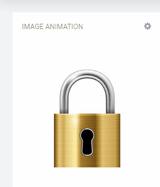

# Image Animation Widget for Cumulocity 

This Image Animation widget is the Cumulocity module federation plugin created using c8ycli. This plugin can be used in Application Builder or Cockpit.
The Image Animation widget supports scrolling an image up, down, left or right, fading in, fading out, rotating an image and swapping from one image to another.

### Please note that this plugin is in currently under BETA mode.

### Please choose Image Animation release based on Cumulocity/Application builder version:

|APPLICATION BUILDER | CUMULOCITY | IMAGE ANIMATION WIDGET |
|--------------------|------------|------------------------|
| 2.x.x(coming soon) | >= 1016.x.x| 1.x.x                  | 

     
## Features

**Scroll Left:** Animate an image such as a gate to scroll left

**Scroll Right:** Animate an image such as a gate to scroll right

**Scroll Up:** Animate an image such as a garage door to scroll upwards 

**Scroll Down:** Animate an image to scroll down

**Fade In:** Fade a hidden image into view

**Fade Out:** Fade an image out of view

**Rotate:** Rotate an image 

**Swap:** Swap one image with another image
  

## Prerequisite
   Cumulocity c8ycli >=1016.x.x
   
   
## Installation

### Runtime Widget Deployment?

* This widget support runtime deployment. Download [Runtime Binary](https://github.com/SoftwareAG/cumulocity-image-animation-widget-plugin/releases/download/1.0.0-beta/image-animation-widget-1.0.0-beta.zip) and install via Administrations(Beta mode) --> Ecosystems --> Applications --> Packages.

## QuickStart

This guide will teach you how to add widget in your existing or new dashboard.

1. Open you application from App Switcher

2. Add new dashboard or navigate to existing dashboard

3. Click `Add Widget`

4. Search for `Image Animation`

5. Select `Target Assets or Devices`

7. Click `Save`

Congratulations! Image Animation is configured.

## Userguide
This guide will teach you how to add the widget in your existing or new dashboard.

NOTE: This guide assumes that you have followed the [installation](https://github.com/SoftwareAG/cumulocity-runtime-widget-loader) instructions

### Configuration options

The widget configuration page contains a number of configuration attributes. These attributes are dependent upon the '**Animation type**' which is selected.

 - **Target Assets or Devices** : Select your device
     
 - 	**Animation type**: `Scroll up`, `Scroll down`, `Scroll left`, `Scroll right`

	- **Image file**
Select the image file which you want to use in the widget. The file type must be either a .png, .jpeg or .jpg.

	- **Event type to animate off to on**
Enter the event type which will animate the image from the scroll start to the scroll end position e.g. OpenGate

	- **Short description when animating off to on**
Enter the description that should be displayed when the animation moves from scroll start to the scroll end position e.g 'Opened the gate'

	- **Event type to animate on to off**
Enter the event type which will animate the image from the scroll end to the scroll start position e.g. CloseGate

	- **Short description when animating off to on**
Enter the description that should be displayed when the animation moves from scroll end to the scroll start position e.g. 'Closed the gate'
	
	 - **Height** (in pixels)
Enter the height (in pixels) for your image e.g. 300

	- **Width** (in pixels)
Enter the width (in pixels) for your image e.g. 500

	- **Remaining image** (in percentage)
Enter the amount of image (as a percentage) which should remain on the screen. If you want the whole image to completely animate off the screen, set this value to 0

	- **Animation time** (in seconds)
Enter the amount of seconds the animation should take to complete e.g. 2. If you want the image to scroll immediately, set this value to 0

	- **Location of the short description**
Select the location where the short description should be displayed from the dropdown

 - **Animation type**: ``Fade in``, `Fade out`

	- **Image file**
Select the image file which you want to use in the widget. The file type must be either a .png, .jpeg or .jpg.
	
	- **Event type to animate off to on**
Enter the event type which will animate the image from the fade start to the fade end position e.g. 'ShowImage'

	- **Short description when animating off to on**
Enter the description that should be displayed when the animation moves from fade start to the fade end position e.g. 'Showing Image'

	- **Event type to animate on to off**
Enter the event type which will animate the image from the fade end to the fade start position e.g. 'HideImage'

	- **Short description when animating off to on**
Enter the description that should be displayed when the animation moves from fade end to the fade start position e.g. 'Hiding image'
	
	- **Height** (in pixels)
Enter the height (in pixels) for your image e.g. 300

	- **Width** (in pixels)
Enter the width (in pixels) for your image e.g. 500

	- **Remaining image** (in percentage)
Enter the amount of image (as a percentage) which should remain on the screen. If you want the whole image to completely fade in or out, set this value to 0

	- **Animation time** (in seconds)
Enter the amount of seconds the animation should take to complete e.g. 2. If you want the image to fade immediately, set this value to 0

	- **Location of the short description**
Select the location where the short description should be displayed from the dropdown

- **Animation type**: ``Rotate``

	- **Image file**
	Select the image file which you want to use in the widget. The file type must be either a .png, .jpeg or .jpg.

	- **Event type to animate off to on**
Enter the event type which will animate the image from the rotate start to the  rotate end position e.g. StartWatering

	- **Short description when animating off to on**
Enter the description that should be displayed when the animation moves from rotate start to the rotate end position e.g. 'Started watering'

	- **Event type to animate on to off**
Enter the event type which will animate the image from the rotate end to the rotate start position e.g. 'StopWatering'

	- **Short description when animating off to on**
Enter the description that should be displayed when the animation moves from rotate end to the rotate start position e.g. 'Stopped watering'
		
	- **Height** (in pixels)
Enter the height (in pixels) for your image e.g. 300

	- **Width** (in pixels)
Enter the width (in pixels) for your image e.g. 500

	- **Rotation** (in degrees)
Enter the amount of degrees the image should rotate. The valid range is -360 to 360. 
To tip the image, like a watering can, enter 60. To invert the image backwards, enter -180

	- **Animation time** (in seconds)
Enter the amount of seconds the animation should take to complete e.g. 2. If you want the image to rotate immediately, set this value to 0

	- **Location of the short description**
Select the location where the short description should be displayed from the dropdown

- **Animation type**: `Swap`

	- **From image file**
	Select the image file which you want to animate from. The file type must be either a .png, .jpeg or .jpg.

	- **To image file**
	Select the image file which you want to animate to. The file type must be either a .png, .jpeg or .jpg.

	- **Event type to animate off to on**
Enter the event type which will animate the image from the the first image to the second image e.g. 'LockPadlock'

	- **Short description when animating off to on**
Enter the description that should be displayed when the animation moves from first image to the second image 'Padlock is locked'

	- **Event type to animate on to off**
Enter the event type which will animate the image from the second image to the first image e.g. 'UnlockPadlock'

	- **Short description when animating off to on**
Enter the description that should be displayed when the animation moves from the second image back to the first image e.g. 'Padlock is unlocked'
		
	- **Height** (in pixels)
Enter the height (in pixels) for your images e.g. 300

	- **Width** (in pixels)
Enter the width (in pixels) for your images e.g. 500

	- **Animation time** (in seconds)
Enter the amount of seconds the animation should take to complete e.g. 2. If you want the image to swap immediately, set this value to 0

	- **Location of the short description**
Select the location where the short description should be displayed from the dropdown

------------------------------

This widget is provided as-is and without warranty or support. They do not constitute part of the Software AG product suite. Users are free to use, fork and modify them, subject to the license agreement. While Software AG welcomes contributions, we cannot guarantee to include every contribution in the master project.

_____________________

For more information you can Ask a Question in the [TECHcommunity Forums](https://tech.forums.softwareag.com/tags/c/forum/1/Cumulocity-IoT).

You can find additional information in the [Software AG TECHcommunity](https://tech.forums.softwareag.com/tag/Cumulocity-IoT).
